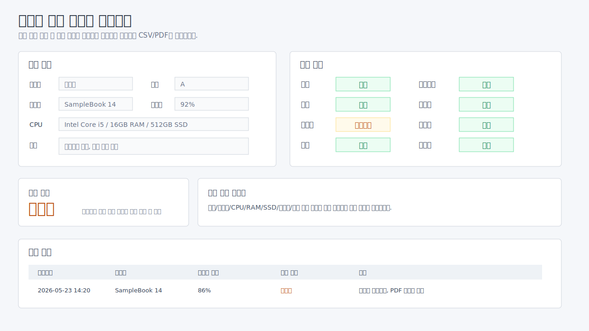

# Notebook Inspection Automation

Windows PowerShell 기반의 노트북 검수 자동화 GUI입니다.

중고/업무용 노트북을 검수할 때 모델명, 시리얼, CPU, RAM/SSD, 배터리 상태, 장치 인식 여부, 포트 상태, 키보드 입력 상태를 반복해서 확인해야 하는 불편함을 줄이기 위해 만든 업무 자동화 도구입니다.

## Project Summary

| Item | Description |
| --- | --- |
| Type | Windows inspection automation utility |
| Role | 개인 업무 자동화 프로젝트 / 설계, 구현, 문서화 |
| Goal | 노트북 검수 입력, 자동 진단, 판정, 리포트 저장 자동화 |
| Platform | Windows |
| Runtime | PowerShell |
| UI | Windows Forms GUI |

## Key Features

- 검수 기본 정보 입력
- 검수 항목별 상태 선택
- 모델명, 시리얼, CPU, RAM/SSD 자동 수집
- 배터리 효율과 사이클 수 확인
- Wi-Fi, 카메라, 스피커 장치 인식 여부 점검
- 키보드 테스트 창으로 실제 키 입력 확인
- 포트 테스트 창으로 USB/HDMI/LAN/오디오잭/충전포트 상태 체크
- 전체 자동진단 결과를 `정상 / 주의 / 불량`으로 요약
- 자동 판정: `합격`, `재검수`, `불합격`
- CSV 이력 저장
- PDF 리포트 출력

## Preview



> 공개 저장소용 샘플 화면입니다. 실제 시리얼, 검수 이력, 리포트 파일은 포함하지 않았습니다.

## Why I Built This

노트북 검수는 같은 항목을 반복해서 확인하는 일이 많습니다. 장비 기본 정보, 배터리 상태, 장치 인식 여부, 포트 상태, 키보드 입력 상태를 사람이 하나씩 기록하면 누락이 생기기 쉽고 시간이 오래 걸립니다.

이 프로젝트는 검수자가 GUI에서 항목을 확인하면서 자동 진단 결과와 수동 체크 결과를 한 화면에서 관리하고, 최종 판정과 리포트를 남길 수 있도록 만들었습니다.

## Judgment Rules

| Condition | Result |
| --- | --- |
| 하나라도 `불량`이 있음 | `불합격` |
| `불량`은 없고 `확인필요`가 있음 | `재검수` |
| 모든 항목이 `정상` | `합격` |
| 배터리 효율 80% 미만 | `재검수` 기준 반영 |

## Hardware Auto Diagnosis

- 시스템에서 조회 가능한 경우 모델명, 시리얼, CPU, 메모리, 디스크 정보를 자동 입력합니다.
- `powercfg /batteryreport`를 이용해 설계용량 대비 완충용량 기준의 배터리 효율을 계산합니다.
- 배터리 효율 80% 미만 또는 사이클 수가 높은 경우 비고에 자동 표시하고 판정에 반영합니다.
- Wi-Fi, 카메라, 스피커 장치 인식 여부를 점검합니다.
- RAM 8GB 미만, 저장장치 256GB 미만은 비고에 자동으로 남깁니다.
- 자동 진단 리포트는 CSV의 `diagnostic_summary` 컬럼에 저장됩니다.

## Tech Stack

| Area | Stack |
| --- | --- |
| Runtime | PowerShell |
| GUI | Windows Forms |
| Report | CSV, PDF print output |
| Windows APIs | WMI/CIM, powercfg, device queries |

## Run

배치 파일로 실행:

```bat
run_inspection_app.bat
```

PowerShell에서 직접 실행:

```powershell
powershell -NoProfile -ExecutionPolicy Bypass -File .\driver_gui.ps1
```

## Output

실행 시 로컬에 아래 폴더가 생성됩니다.

```text
data/
reports/
```

- `data/inspections.csv`: 검수 이력 저장
- `reports/`: PDF 출력 결과 저장

공개 저장소에는 실제 검수 이력과 리포트를 포함하지 않습니다.

## Project Structure

```text
inspection-automation/
├── driver_gui.ps1
├── run_inspection_app.bat
├── README.md
└── .gitignore
```

## What I Learned

- PowerShell Windows Forms로 업무용 GUI를 만드는 방식
- WMI/CIM과 Windows 명령을 이용해 하드웨어 정보를 수집하는 방법
- 자동 진단 결과와 수동 검수 결과를 함께 판정하는 구조
- 업무 도구에서는 저장 이력, 리포트 출력, 예외 처리, 개인정보 제외가 중요하다는 점

## Safety Notes

- 이 도구는 실제 검수 결과를 `data`와 `reports`에 저장합니다.
- 공개 저장소에는 실제 장비 시리얼, 검수자명, 검수 이력, PDF 리포트를 포함하지 않습니다.
- Windows 권한 또는 장치 드라이버 상태에 따라 일부 자동 진단 항목은 조회가 실패할 수 있습니다.
